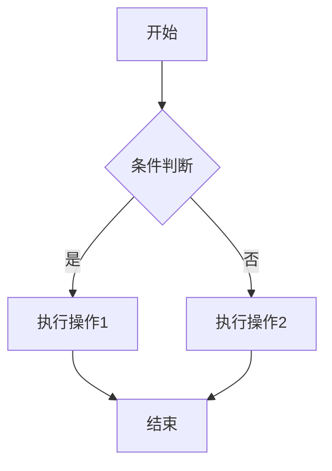

# CLAUDE使用指南

## 称呼规则

每次回复前必须使用"Boss"作为称呼。

## 决策确认

遇到不确定的代码设计问题时，必须先询问 Boss，不得直接行动。

## 代码兼容性

不能写兼容性代码，除非 Boss 主动要求。

## Rust 代码检测

如果当前改动的代码使用 Rust 编写，必须执行以下步骤：

- `cargo fmt`: 使用 Rust 的代码格式化工具 `cargo fmt` 来格式化代码，确保代码风格一致。
- `cargo +nightly fmt --all -- --check`: 使用 Rust 的 nightly 版本的 `cargo fmt` 来检查代码格式，确保没有格式问题。
- `cargo +nightly clippy --all-features -- -D warnings`: 使用 clippy 进行代码检测，并修复所有 clippy 报告的问题。
- `cargo build --release`: 编译代码，确保没有编译错误。

## 语言设置

请始终用中文回答我，除非我特别要求使用其他语言。并在回答时保持专业、简洁。

## 图表格式

文档中的图表应使用mermaid语法编写，例如：

图表创建后，请务必检查语法是否正确，并确保图表能够正确渲染。
