<p align="center">
  
</p>

<h1 align="center">Mysis</h1>

<p align="center">
  <strong>An OpenClaw implementation designed for ESP32 environments.</strong><br>
  🦀 <strong>Built with Rust.</strong>
</p>

<p align="center">
  🌐 <strong>Languages:</strong>
  <a href="README.md">🇺🇸 English</a> ·
  <a href="README.zh-CN.md">🇨🇳 简体中文</a>
</p>

## Overview

Mysis is a lightweight AI Agent system designed for ESP32-S3. It focuses on smart home control scenarios (switching lights, watering, feeding, etc.) using a **distributed architecture**: ESP32 runs the agent loop and hardware control, while Mac Studio runs the LLM inference service. The entire project is developed in **pure Rust**.

## Architecture

```mermaid
---
config:
  flowchart:
    curve: stepBefore
---
graph LR
    subgraph Mac["🖥️ Mac Studio"]
        direction TB
        LLM["🤖 LLM Server\n(HTTP API)"]
        Bridge["🌉 Mysis Bridge"]
        Broker["📮 Mosquitto\n(MQTT Broker)"]
        LLM --- Bridge --- Broker
    end

    subgraph ESP["🔌 ESP32-S3"]
        direction TB
        Transport["📡 MQTT Transport"]
        Agent["🧠 Agent Loop"]
        Tools["🔧 Tool Registry"]
        GPIO["⚡ GPIO / PWM / I2C"]
        Transport --- Agent --- Tools --- GPIO
    end

    Broker <-.->|WiFi + MQTT| Transport

    style ESP fill:#fff5f5,stroke:#e74c3c,stroke-width:2px,color:#333
    style Mac fill:#f0f7ff,stroke:#3498db,stroke-width:2px,color:#333
    style GPIO fill:#fadbd8,stroke:#e74c3c,color:#333
    style Tools fill:#f5b7b1,stroke:#cb4335,color:#333
    style Agent fill:#d4a0a0,stroke:#b03a2e,color:#333
    style Transport fill:#d7bde2,stroke:#8e44ad,color:#333
    style LLM fill:#aed6f1,stroke:#2980b9,color:#333
    style Bridge fill:#d4e6f1,stroke:#2471a3,color:#333
    style Broker fill:#d7bde2,stroke:#8e44ad,color:#333
```



## Project Structure

```text
mysis-core/          # Platform-agnostic core: Agent loop, Tool trait, MQTT protocol types
mysis-bridge/        # Mac Studio service: MQTT ↔ HTTP forwarding, device management
mysis-esp32/         # ESP32-S3 firmware: WiFi, MQTT, GPIO tools
```

## Mysis vs ZeroClaw

Using ZeroClaw as a blueprint, Mysis is designed for the ESP32 platform with an Agent loop + Tool trait architecture. It strips desktop-level features (memory, multi-channel, Gateway) and adds ESP32 hardware drivers with distributed MQTT communication to run on a microcontroller with 512KB SRAM.

<div align="center">

| Dimension | **Mysis** | **ZeroClaw** |
|-----------|-----------|--------------|
| **Target** | ESP32 smart home AI Agent | General-purpose autonomous AI Agent runtime |
| **Hardware** | ESP32-S3 (512KB SRAM + 8MB PSRAM) | Desktop/server ($10+ Linux devices) |
| **Runtime** | Synchronous blocking (esp-idf, FreeRTOS) | Tokio async (multi-threaded) |
| **Memory** | ~276 KB (embedded-optimized) | < 5 MB (desktop-grade) |
| **Binary** | Cross-compiled | ~8.8 MB (release) |

</div>

### Architecture Comparison

<div align="center">

| Dimension | **Mysis** | **ZeroClaw** |
|-----------|-----------|--------------|
| **Agent Loop** | Simple iteration (max 5 rounds) | Complex iteration (10 rounds + history compression + streaming drafts) |
| **LLM Integration** | Via Bridge (MQTT → HTTP) | Direct call (30+ Providers, auto-failover) |
| **Tool System** | 2 tools (gpio_write/read) | 40+ tools (shell, file, git, browser, memory...) |
| **Tool Dispatcher** | OpenAI function-calling only | OpenAI + XML (Qwen) dual-mode |
| **Channels** | MQTT only | 18+ channels (Telegram, Discord, Slack, DingTalk...) |
| **Memory System** | None | SQLite FTS5 + vector hybrid search |
| **Security** | None (MVP) | Pairing code + Bearer token + AES-256 + workspace isolation |
| **Observability** | `log` macros | Prometheus + OpenTelemetry + structured tracing |

</div>

### Unique to Mysis

- **Distributed agent model** — ESP32 agent + Mac Studio LLM, bridged via MQTT (ZeroClaw is monolithic)
- **Embedded hardware drivers** — Direct GPIO/PWM/I2C control (ZeroClaw uses serial indirectly)
- **Bridge forwarding layer** — Dedicated MQTT ↔ HTTP protocol conversion service

### Unique to ZeroClaw

- SOP engine (automated workflows)
- Gateway (Webhook/WebSocket/SSE server)
- Skills system (user capability extensions)
- Robot Kit (motor/sensor/camera/TTS)
- Multi-Provider routing with failover
- Full security stack
