<p align="center">
  
</p>

<h1 align="center">Mysis</h1>

<p align="center">
  <strong>一个适合 ESP32 环境的 OpenClaw 实现。</strong><br>
  🦀 <strong>采用 Rust 语言开发。</strong>
</p>

<p align="center">
  🌐 <strong>语言:</strong>
  <a href="README.md">🇺🇸 English</a> ·
  <a href="README.zh-CN.md">🇨🇳 简体中文</a>
</p>

## 概述

Mysis 是一个为 ESP32-S3 设计的轻量级 AI Agent 系统，专注于智能家居控制场景（开关灯、浇水、喂食等）。采用**分布式架构**：ESP32 负责 agent 循环和硬件控制，Mac Studio 运行 LLM 推理服务。整个项目采用**全 Rust** 开发。

## 架构

```mermaid
---
config:
  flowchart:
    curve: stepBefore
---
graph LR
    subgraph Mac["🖥️ Mac Studio"]
        direction TB
        LLM["🤖 LLM Server\n(HTTP API)"]
        Bridge["🌉 Mysis Bridge"]
        Broker["📮 Mosquitto\n(MQTT Broker)"]
        LLM --- Bridge --- Broker
    end

    subgraph ESP["🔌 ESP32-S3"]
        direction TB
        Transport["📡 MQTT Transport"]
        Agent["🧠 Agent Loop"]
        Tools["🔧 Tool Registry"]
        GPIO["⚡ GPIO / PWM / I2C"]
        Transport --- Agent --- Tools --- GPIO
    end

    Broker <-.->|WiFi + MQTT| Transport

    style ESP fill:#fff5f5,stroke:#e74c3c,stroke-width:2px,color:#333
    style Mac fill:#f0f7ff,stroke:#3498db,stroke-width:2px,color:#333
    style GPIO fill:#fadbd8,stroke:#e74c3c,color:#333
    style Tools fill:#f5b7b1,stroke:#cb4335,color:#333
    style Agent fill:#d4a0a0,stroke:#b03a2e,color:#333
    style Transport fill:#d7bde2,stroke:#8e44ad,color:#333
    style LLM fill:#aed6f1,stroke:#2980b9,color:#333
    style Bridge fill:#d4e6f1,stroke:#2471a3,color:#333
    style Broker fill:#d7bde2,stroke:#8e44ad,color:#333
```



## 项目结构

```text
mysis-core/          # 平台无关核心：Agent 循环、Tool trait、MQTT 协议类型
mysis-bridge/        # Mac Studio 服务：MQTT ↔ HTTP 转发、设备管理
mysis-esp32/         # ESP32-S3 固件：WiFi、MQTT、GPIO 工具
```

## Mysis vs ZeroClaw

以 ZeroClaw 为蓝本，Mysis 针对 ESP32 平台进行设计，采用 Agent 循环 + Tool trait 设计，裁剪掉桌面级功能（记忆、多渠道、Gateway），加入了 ESP32 硬件驱动和分布式 MQTT 通信，使其能在 512KB SRAM 的微控制器上运行。

| 维度 | **Mysis** | **ZeroClaw** |
| --- | --- | --- |
| **定位** | ESP32 智能家居 AI Agent | 通用自主 AI Agent 运行时 |
| **目标硬件** | ESP32-S3 (512KB SRAM + 8MB PSRAM) | 桌面/服务器 ($10+ Linux 设备) |
| **运行时** | 同步阻塞 (esp-idf, FreeRTOS) | Tokio 异步 (多线程) |
| **内存占用** | ~276 KB (嵌入式优化) | < 5 MB (桌面级) |
| **二进制大小** | 交叉编译 | ~8.8 MB (release) |

### 架构对比

| 维度 | **Mysis** | **ZeroClaw** |
| --- | --- | --- |
| **Agent 循环** | 简单迭代 (最多 5 轮) | 复杂迭代 (10 轮 + 历史压缩 + 流式草稿) |
| **LLM 集成** | 通过 Bridge 转发 (MQTT → HTTP) | 直接调用 (30+ Provider, 自动故障转移) |
| **工具系统** | 2 个 (gpio_write/read) | 40+ 个 (shell, file, git, browser, memory...) |
| **Tool Dispatcher** | 仅 OpenAI function-calling | OpenAI + XML (Qwen) 双模式 |
| **通信渠道** | 仅 MQTT | 18+ 渠道 (Telegram, Discord, Slack, 钉钉...) |
| **记忆系统** | 无 | SQLite FTS5 + 向量混合搜索 |
| **安全** | 无 (MVP) | 配对码 + Bearer token + AES-256 + workspace 隔离 |
| **可观测性** | `log` 宏 | Prometheus + OpenTelemetry + 结构化 tracing |

### Mysis 独有

- **分布式代理模式** — ESP32 agent + Mac Studio LLM，通过 MQTT 桥接（ZeroClaw 是单体架构）
- **嵌入式硬件驱动** — 直接操作 GPIO/PWM/I2C（ZeroClaw 通过串口间接控制）
- **Bridge 转发层** — 专门的 MQTT ↔ HTTP 协议转换服务

### ZeroClaw 独有

- SOP 引擎（自动化工作流）
- Gateway（Webhook/WebSocket/SSE 服务）
- Skills 系统（用户能力扩展）
- Robot Kit（电机/传感器/摄像头/TTS）
- 多 Provider 路由与故障转移
- 完整的安全体系
